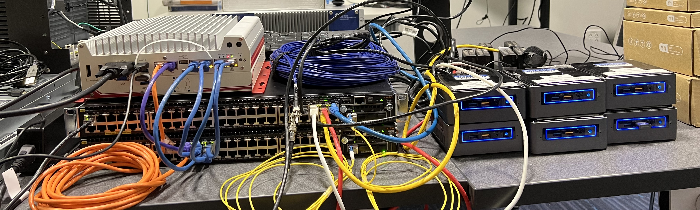

<div style="
  height: auto; 
  width: 100%; 
  overflow: hidden;
">
  
</div>

# Testing 10G SFP+ Bidirectional Transceivers

This page will document the process I used to test a pair of 10G Bidi's using a simple network setup around a pair of Aruba 3810M network switches. For a full list of equipment used, see the last section about [my equipment & other notes](#equipment--other-notes).

#### Contents:

- [Switch Setup](#switch-setup)
- [Network Architecture & Configuration](#network-architecture--configuration)
- [iPerf & Testing](#iperf--testing)
- [Troubleshooting & Workarounds](#troubleshooting--workarounds)
- [Equipment & Other Notes](#equipment--other-notes)

---

## Switch Setup

For this project, I used a pair of [Aruba 3810M switches](#equipment--other-notes), each outfitted with a [JL083A expansion module for SFP+](#equipment--other-notes). To factory reset a switch or configure a factory-default switch, follow the steps below.

### Factory Reset

To reset the Aruba 3810M, follow the instructions on page 94 of [this Installation and Getting Started Guide](https://www.arubanetworks.com/techdocs/hardware/switches/3810/IGSG/3810_igsg.pdf). Specifically, I used these instructions:

1. Using pointed objects, simultaneously press both the Reset and Clear buttons on the front of the switch.
2. Continue to press the Clear button while releasing the Reset button.
3. When the Global Status LED begins to fast flash orange (after approximately 5 seconds), release the Clear button.
4. The switch will then complete its boot process and begin operating with its configuration restored to the factory default settings.

I found that this process takes less than 5 minutes.

### Initial Configuration

A factory-default switch can only be managed through a direct console connection. To access the serial console, connect a micro USB → USB-A cable to the micro USB port on the right side of the front of the switch, labeled "Console Ports". Connect the USB-A side of the cable to a computer which has [PuTTY](https://www.putty.org/) installed. PuTTY will act as a serial console emulator since this serial micro USB port expects to send information to a [VT 100 terminal](https://en.wikipedia.org/wiki/VT100).

To setup PuTTY for this purpose in Windows 10, follow the steps below:

1. Find the name of the serial port which is connected.
   1. Open the Device Manager
   2. In the menu bar at the top of the window, click "View" → "Show hidden devices".
   3. Open the drop-down labeled "Ports (COM & LPT)"
   4. The name of the port is inside the parentheses at the end of the entry: "USB Serial Device (COM3)" means the port name is "COM3".
2. Configure PuTTY for connection.
   1. In the menu at the left side of the PuTTY window, select "Serial", located in the "Connection" submenu. Set the following:
      - Serial line connect to: COM3
      - Speed (baud): 9600
      - Data bits: 8
      - Stop bits: 1
      - Parity: none
      - Flow control: XON/XOFF
3. Click the "Open" button at the bottom of the window to launch the terminal window.

> Once the PuTTY terminal window boots, it may appear blank. Pressing RETURN should show the command line prompt, which in my case is `Aruba-3810M-48G-PoEP-1-slot# `. If this appears, you are connected correctly.

To complete the minimal configuration through the console port, follow these instructions:

1. Type the `setup` command to enter the Switch Setup screen. You should see something like the following:

```
Aruba-3810M                                                12-Jul-2022  14:52:07
===========================- TELNET - MANAGER MODE -============================
                                  Switch Setup

  System Name : Aruba-3810M-48G-PoEP-1-slot
  System Contact :
  Manager Password : ****************
  Confirm Password : ****************
  Logon Default : CLI                   Time Zone [0] : 0
  Community Name : public
  Spanning Tree Enabled [No] : No       Default Gateway : 192.168.0.1
  Time Sync Method [TIMEP/SNTP] : TIMEP/SNTP
  TIMEP Mode [Disabled] : Disabled


  IP Config [Manual] : Manual

  IP Address  : 192.168.0.100
  Subnet Mask : 255.255.255.0
 Actions->   Cancel     Edit     Save     Help

Enter System Name - up to 32 characters.
Use arrow keys to change field selection, <Space> to toggle field choices,
and <Enter> to go to Actions.
```

2. Use the TAB key or the arrow keys to navigate to the `Manager Password` field. Input a new password and confirm the same password on the following line.
3. Navigate to the `IP Config` field and use the space bar to select the `Manual` option.
4. Navigate to the `IP Address` field and set a static IP address. Set the appropriate subnet mask on the next line. This information will apply to the default VLAN. I set mine to:

```
IP Address: 192.168.2.2
Subnet Mask: 255.255.255.0
```

5. Press `ENTER` and then `S` to save.

Once you have set an IP address in this way, the switch can be managed via the browser-based GUI by navigating to its address:

1. Connect a computer to the same network as the Aruba.
2. Open a web browser and search for the IP address that you set via the serial console.
3. Login using the username and password set during the setup process.

### SSH Access

SSH is enabled by default on this Aruba switch. You can SSH from a connected computer via the command line using this command, replacing the IP address with the one set during the above setup:

```
ssh manager@192.168.2.2
```

Make sure to follow these steps for both switches which will be used. When setting an IP for the second switch I chose `192.168.2.3`.

### Connect the Switches via Fiber

Once both switches have been configured, connect them using the bidi's and a fiber cable. Make sure to use bidi's which are compatible with the switches you are using. After inserting each bidi into each switch, it should blink green within \~5 seconds, indicating that the switch is compatible and the bidi is ready for a connection.

Since the bidi's accept an LC connection, I used a 30 m ST-ST cable, two ST-ST adapters, and two ST-LC cables to connect them. Since they have been configured on the same subnet, they should be able to communicate across the fiber connection without any further configuration.

## Network Architecture & Configuration

Now that the switches have been configured, a network can be setup using them. I setup my network using 6 [Intel NUC](#equipment--other-notes)'s, one of which acts as a DHCP server, and a 6-port [logic supply](#equipment--other-notes).

### DHCP

To start, configure the DHCP server. Due to a previous project, I already had one configured using [Ubuntu Server 20.04](https://releases.ubuntu.com/20.04/). To configure a similar server, follow the steps below:

1. Install Ubuntu Server 20.04 on an Intel NUC. I used a bootable USB installer, created with [this Ubuntu Server ISO](https://releases.ubuntu.com/20.04/ubuntu-20.04.4-live-server-amd64.iso) and a tool like [Rufus](https://rufus.ie/en/).
2. There is only one necessary package for this project, `isc-dhcp-server`:

```
sudo apt-get install isc-dhcp-server
```

3. The DHCP server will work best if the server is configured with a static IP. In Ubuntu 20.04, this can be set through the `netplan`:

```
sudo nano /etc/netplan/01-netcfg.yaml
```

Change the text in this `01-netcfg.yaml` file to this:

```
network:
  version: 2
  renderer: networkd
  ethernets:
    eno1:
      dhcp4: no
      addresses:
        - 192.168.2.10/24
      gateway4: 192.168.2.1
      nameservers:
        addresses: [1.1.1.1, 1.0.0.1]
```

> make sure to change `eno1` to the correct interface name. Apply the netplan with this command:

```
sudo netplan apply
```

4. Once a static IP is set, the DHCP server can be configured through `dhcpd.conf`:

```
sudo nano /etc/dhcp/dhcpd.conf
```

Make sure the following is included in this config file:

```
# make sure to update the ip and mac addresses as appropriate.
subnet 192.168.2.0 netmask 255.255.255.0 {
        # I set a range of .106 to .200, as this far exceeds the < 15 devices I plan on testing.
        range 192.168.2.106 192.168.2.200;
        option routers 192.168.2.1;
        default-lease-time 3600;
        max-lease-time 86400;
        next-server 192.168.2.10;
}

host desktop {
        hardware ethernet 94:c6:91:a1:1f:a5;
        fixed-address 192.168.2.10;
}

ddns-update-style none;

authoritative;
```

5. To apply the changes and ensure it is working, restart the server and check its status.

```
sudo systemctl restart isc-dhcp-server
sudo systemctl status isc-dhcp-server
```

At this point, the DHCP server should be up and running. You should see an output from the status message something like this:

```
● isc-dhcp-server.service - ISC DHCP IPv4 server
     Loaded: loaded (/lib/systemd/system/isc-dhcp-server.service; enabled; vendor preset: enabled)
     Active: active (running) since Mon 2022-07-11 13:57:54 UTC; 6h ago
       Docs: man:dhcpd(8)
   Main PID: 902 (dhcpd)
      Tasks: 4 (limit: 38297)
     Memory: 6.8M
     CGroup: /system.slice/isc-dhcp-server.service
             └─902 dhcpd -user dhcpd -group dhcpd -f -4 -pf /run/dhcp-server/dhcpd.pid -cf /etc/dhcp/dhcpd.conf eno1

Jul 11 20:01:28 server dhcpd[902]: DHCPACK on 192.168.2.106 to 8c:04:ba:35:4b:76 (DESKTOP-H2PRVNN) via eno1
Jul 11 20:03:01 server dhcpd[902]: DHCPREQUEST for 192.168.2.111 from 78:d0:04:26:19:0f (logic) via eno1
Jul 11 20:03:01 server dhcpd[902]: Wrote 0 deleted host decls to leases file.
Jul 11 20:03:01 server dhcpd[902]: Wrote 0 new dynamic host decls to leases file.
Jul 11 20:03:01 server dhcpd[902]: Wrote 21 leases to leases file.
Jul 11 20:03:01 server dhcpd[902]: DHCPACK on 192.168.2.111 to 78:d0:04:26:19:0f (logic) via eno1
Jul 11 20:04:11 server dhcpd[902]: DHCPREQUEST for 192.168.2.115 from 78:d0:04:26:19:0a (logic) via eno1
Jul 11 20:04:11 server dhcpd[902]: DHCPACK on 192.168.2.115 to 78:d0:04:26:19:0a (logic) via eno1
Jul 11 20:04:33 server dhcpd[902]: DHCPREQUEST for 192.168.2.127 from 94:c6:91:a2:2a:db (nuc3) via eno1
Jul 11 20:04:33 server dhcpd[902]: DHCPACK on 192.168.2.127 to 94:c6:91:a2:2a:db (nuc3) via eno1
```

If not, check the [troubleshooting section](#troubleshooting--workarounds) for possible solutions.

### DHCP Clients

Now that the DHCP server has been setup, other interfaces connected to the network will be automatically assigned an IP. In my case, I connected 5 more NUC's as well as all 6 ports of the logic supply I used. I plan on configuring the logic supply interfaces as the [iPerf](https://iperf.fr/) servers and all the NUC's as iPerf clients.

Note that more computers can easily be added to the network if necessary. While I didn't need to test all the way to 10G, the network can easily be expanded to encompass 20 interfaces, allowing for a 10G test. Going forward, I am only testing up to 6G.

I installed the same release of Ubuntu Server 20.04 on the other devices I used for this. The last step before testing the network is to install [iPerf](https://iperf.fr/) on all the devices. Since I am working without a direct internet connection on all the devices used, I copied the appropriate [Ubuntu binaries](https://iperf.fr/iperf-download.php#ubuntu) to a flash drive and manually installed in on each device:

1. Download the [iPerf Ubuntu binaries](https://iperf.fr/iperf-download.php#ubuntu) to a computer which has network connection. I used `iPerf_3.9.deb` + `libiperf0_3.9-1.deb` + `libsctp1_1.0.18+dfsg-1.deb`. Copy the files to a flash drive.
2. Connect the flash drive to one of the networked computers. Use `fdisk` to find the name of the drive, and then mount it:

```
sudo fdisk -l
```

```
Disk /dev/loop1: 69.9 MiB, 73277440 bytes, 143120 sectors
Units: sectors of 1 * 512 = 512 bytes
Sector size (logical/physical): 512 bytes / 512 bytes
I/O size (minimum/optimal): 512 bytes / 512 bytes

...

Disk /dev/sdb: 29.9 GiB, 32080200192 bytes, 62656641 sectors
Disk model: Flash Drive FIT
Units: sectors of 1 * 512 = 512 bytes
Sector size (logical/physical): 512 bytes / 512 bytes
I/O size (minimum/optimal): 512 bytes / 512 bytes
Disklabel type: dos
Disk identifier: 0x1dee8e35

Device     Boot Start      End  Sectors  Size Id Type
/dev/sdb1          63 62656640 62656578 29.9G  7 HPFS/NTFS/exFAT
```

In this case, `/dev/sdb1` is the name and location of the partition that needs to be mounted. I like to create a `/media/USB` directory to mount USB drives to:

```
sudo mkdir /media/USB
sudo mount /dev/sdb1 /media/USB
cd /media/USB
```

Make sure these files are in the USB directory:

```
iperf3_3.9-1_amd64.deb   libiperf0_3.9-1_amd64.deb   libsctp1_1.0.18+dfsg-1_amd64.deb
```

3. Once mounted, install the packages. This order matters, and the installation may fail if installed in the incorrect order.

```
sudo dpkg -i libsctp1_1.0.18+dfsg-1_amd64.deb
sudo dpkg -i libiperf0_3.9-1_amd64.deb
sudo dpkg -i iperf3_3.9-1_amd64.deb
```

Now, iPerf should be installed. You should see the help file when using the `iperf3` command: `iperf3`

```
iperf3: parameter error - must either be a client (-c) or server (-s)

Usage: iperf3 [-s|-c host] [options]
       iperf3 [-h|--help] [-v|--version]

Server or Client:
  -p, --port      #         server port to listen on/connect to
  -f, --format   [kmgtKMGT] format to report: Kbits, Mbits, Gbits, Tbits
...
```

## iPerf & Testing

To start iPerf and begin testing the network, I SSH'd into all 12 interfaces from my laptop, each in a different instance of command prompt.

```
ssh username@192.168.2.xxx
```

On the interfaces I needed to configure as iPerf servers, I started the iPerf listener with the following:

```
iperf3 -s -B 192.168.2.xxx -p 600x
```

> Replace `192.168.2.xxx` with the appropriate ip for the interface, and increment `600x` each time. e.g. `iperf3 -s -B 192.168.2.111 -p 6000`, `iperf3 -s -B 192.168.2.112 -p 6001`, etc.

In this case, `-s` indicates that this is a server interface, `-B` binds the iPerf instance to the specified IP (this is important since the logic supply has 6 different interfaces which can all be accessed), and `-p` indicates the port number. For more information about the available parameters, see the [iPerf documentation](https://iperf.fr/iperf-doc.php#3doc).

You should see the following once the server is running (replace 6000 with the appropriate port number):

```
-----------------------------------------------------------
Server listening on 6000
-----------------------------------------------------------

```

> I tried concatenating commands from a single ssh instance, but found that it didn't work correctly. e.g. `iperf3 -s -B 192.168.2.111 -p 6000 & iperf3 -s -B 192.168.2.112 -p 6001 ...`. In this case, it appears that the entire system was rate-limited to 1G, despite the connections sending and receiving on different IP's.

The last step is to start the iPerf client on each of the client interfaces. To do so, use the following command:

```
iperf3 -c 192.168.2.xxx -p 600x
```

Now, `-c` indicates that this is a client, and the following IP address is the location of the server to connect to. Again, `-p` indicates the appropriate port number to connect over. Make sure these numbers match each of the server listeners you configured above. The default time for an iPerf test is 10 seconds. To extend this time, add `-t n` to the client command, replacing n with the number of seconds the client should run.

Everything is now in place to test the network. Start each client connection and let them all run at the same time. At the end of the test, you should see the results for each client/server pair:

```
manager@nuc1:/$ iperf3 -c 192.168.2.111
Connecting to host 192.168.2.111, port 5201
[  5] local 192.168.2.125 port 55990 connected to 192.168.2.111 port 5201
[ ID] Interval           Transfer     Bitrate         Retr  Cwnd
[  5]   0.00-1.00   sec   112 MBytes   942 Mbits/sec    0    352 KBytes
[  5]   1.00-2.00   sec   112 MBytes   940 Mbits/sec    0    369 KBytes
[  5]   2.00-3.00   sec   111 MBytes   929 Mbits/sec    0    369 KBytes
[  5]   3.00-4.00   sec   112 MBytes   937 Mbits/sec    0    369 KBytes
[  5]   4.00-5.00   sec   112 MBytes   936 Mbits/sec    0    369 KBytes
[  5]   5.00-6.00   sec   111 MBytes   930 Mbits/sec    0    369 KBytes
[  5]   6.00-7.00   sec   112 MBytes   937 Mbits/sec    0    369 KBytes
[  5]   7.00-8.00   sec   111 MBytes   934 Mbits/sec    0    369 KBytes
[  5]   8.00-9.00   sec   111 MBytes   933 Mbits/sec    0    369 KBytes
[  5]   9.00-10.00  sec   111 MBytes   935 Mbits/sec    0    369 KBytes
- - - - - - - - - - - - - - - - - - - - - - - - -
[ ID] Interval           Transfer     Bitrate         Retr
[  5]   0.00-10.00  sec  1.09 GBytes   935 Mbits/sec    0             sender
[  5]   0.00-10.00  sec  1.09 GBytes   934 Mbits/sec                  receiver

iperf Done.
```

For this test, you can see that the bitrate is very close to the 1 Gbit benchmark.

## Troubleshooting & Workarounds

### Test Fiber Connection

Once the switches have been configured, you may need to test the fiber connection. An easy way to do this is by pinging across the switches.

If you already have a DHCP server setup, simply connect the server to one switch and a DHCP client to the other switch. You should be able to ping from the client to the server to ensure it is working.

If you don't have a DHCP server setup, you can also ping from one switch to the other.

- SSH into one of the switches:

```
ssh manager@192.168.2.2
```

- Ping from one switch to the other:

```
Aruba-3810M# ping 192.168.2.3
192.168.2.3 is alive, time = 2 ms
```

### DHCP

#### Check DHCP Leases

An easy way to check which computers are connected to the DHCP server is by viewing the server's leases. One command to do so is:

```
dhcp-lease-list
```

```
To get manufacturer names please download http://standards.ieee.org/regauth/oui/oui.txt to /usr/local/etc/oui.txt
Reading leases from /var/lib/dhcp/dhcpd.leases
MAC                IP              hostname       valid until         manufacturer
===============================================================================================
78:d0:04:26:19:0a  192.168.2.115   logic          2022-07-11 21:34:11 -NA-
78:d0:04:26:19:0b  192.168.2.116   logic          2022-07-11 21:40:24 -NA-
78:d0:04:26:19:0c  192.168.2.114   logic          2022-07-11 21:39:10 -NA-
78:d0:04:26:19:0d  192.168.2.113   logic          2022-07-11 22:00:44 -NA-
78:d0:04:26:19:0e  192.168.2.112   logic          2022-07-11 22:00:36 -NA-
78:d0:04:26:19:0f  192.168.2.111   logic          2022-07-11 22:03:02 -NA-
8c:04:ba:35:4b:76  192.168.2.106   DESKTOP-H2PRVN 2022-07-11 21:57:32 -NA-
94:c6:91:1d:a1:68  192.168.2.123   nuc0           2022-07-11 22:11:24 -NA-
94:c6:91:a1:1d:a3  192.168.2.125   nuc1           2022-07-11 22:00:20 -NA-
94:c6:91:a1:1e:dd  192.168.2.108   slax           2022-07-11 21:33:55 -NA-
94:c6:91:a2:2a:db  192.168.2.127   nuc3           2022-07-11 21:34:32 -NA-
94:c6:91:a2:2c:dc  192.168.2.124   nuc2           2022-07-11 22:11:24 -NA-
```

In this case, I can tell that everything is connected to the network. There are six different `logic` interfaces, as well as `nuc0` through `nuc3` and `slax`, which are the NUC's.

#### Test DHCP from Windows

If you are connected to the DHCP server's network on a Windows computer, you can check for connected DHCP servers through the command prompt:

1. Open the Command Prompt
2. Type:

```
ipconfig /all | find /i “DHCP Server”
```

3. You should see the IP address of the server you setup. In my case it shows:

```
   DHCP Server . . . . . . . . . . . : 192.168.2.10
```

### Rate-limiting

It seems that most systems are rate-limited to send only 1G spread across all interfaces. One initial solution I tried was to use only 2 NUC's and multiple ethernet → USB adapters. While I got 1G speeds when testing a single server/client pair as expected, I was unable to get anything more than that when testing two pairs at the same time. Here is an example of testing both connections at the same time:

```
Accepted connection from 192.168.2.108, port 36845
[  5] local 192.168.2.11 port 10000 connected to 192.168.2.108 port 57105
[ ID] Interval           Transfer     Bitrate
[  5]   0.00-1.00   sec  42.3 MBytes   355 Mbits/sec
[  5]   1.00-2.00   sec  44.6 MBytes   374 Mbits/sec
[  5]   2.00-3.00   sec  44.5 MBytes   373 Mbits/sec
[  5]   3.00-4.00   sec  44.6 MBytes   374 Mbits/sec
[  5]   4.00-5.00   sec  44.5 MBytes   374 Mbits/sec
[  5]   5.00-6.00   sec  45.0 MBytes   378 Mbits/sec
[  5]   6.00-7.00   sec  49.1 MBytes   412 Mbits/sec
[  5]   7.00-8.00   sec  46.0 MBytes   386 Mbits/sec
[  5]   8.00-9.00   sec  46.3 MBytes   388 Mbits/sec
[  5]   9.00-10.00  sec  73.8 MBytes   619 Mbits/sec
[  5]  10.00-10.00  sec   204 KBytes   884 Mbits/sec
- - - - - - - - - - - - - - - - - - - - - - - - -
[ ID] Interval           Transfer     Bitrate
[  5]   0.00-10.00  sec   481 MBytes   403 Mbits/sec
```

```
Accepted connection from 192.168.2.110, port 52271
[  5] local 192.168.2.10 port 5201 connected to 192.168.2.110 port 60935
[ ID] Interval           Transfer     Bitrate
[  5]   0.00-1.00   sec  87.8 MBytes   737 Mbits/sec
[  5]   1.00-2.00   sec  66.9 MBytes   561 Mbits/sec
[  5]   2.00-3.00   sec  66.8 MBytes   560 Mbits/sec
[  5]   3.00-4.00   sec  66.9 MBytes   561 Mbits/sec
[  5]   4.00-5.00   sec  66.8 MBytes   560 Mbits/sec
[  5]   5.00-6.00   sec  66.9 MBytes   561 Mbits/sec
[  5]   6.00-7.00   sec  63.8 MBytes   535 Mbits/sec
[  5]   7.00-8.00   sec  63.9 MBytes   536 Mbits/sec
[  5]   8.00-9.00   sec  65.3 MBytes   547 Mbits/sec
[  5]   9.00-10.00  sec  64.7 MBytes   543 Mbits/sec
[  5]  10.00-10.00  sec   137 KBytes   397 Mbits/sec
- - - - - - - - - - - - - - - - - - - - - - - - -
[ ID] Interval           Transfer     Bitrate
[  5]   0.00-10.00  sec   680 MBytes   570 Mbits/sec
```

As you can see, the transfers still only sums to just about 1 Gbit, rather than the 2 Gbit I expected.

The only solution I found to this was to use multiple client systems. The final configuration I used consists of one server system (the logic supply) and six separate client systems (the NUC's). In this setup, everything behaves as expected, with the server system capable of receiving 6G simultaneously. I also tested the reverse, using a single client system (the logic supply) and six servers (the NUC's), but found it was still rate-limited to 1G sending across all interfaces.

## Equipment & Other Notes

For this project, I used:

- A [Dell Latitude 5590](https://www.dell.com/support/home/en-us/product-support/product/latitude-15-5590-laptop/docs) running Windows 10 Enterprise.
- 6 [Intel NUC's](https://ark.intel.com/content/www/us/en/ark/products/95067/intel-nuc-kit-nuc7i5bnh.html), each running [Ubuntu 20.04](https://releases.ubuntu.com/20.04/)
- 1 [Nuvo 5006-E Logic supply](https://www.neousys-tech.com/en/product/feature/fanless-computer/nuvo-5000)
- 2 [Aruba 3810M Network Switches](), each equipped with an [Aruba JL083A Expansion Module](https://buy.hpe.com/us/en/options/modules/switch-modules/switch-connectivity-modules/aruba-switch-sfp-modules/aruba-3810m-2930m-4-port-100m-1g-10g-sfp-macsec-module/p/JL083A).
- 2 [10G SFP+ Bidirectional Transceivers]()
- 1 [30 meter ST-ST fiber cable]()
- 2 [ST-ST adapters](https://www.fs.com/products/132211.html)
- 2 [2 meter ST-LC fiber cables](https://www.fs.com/products/40626.html)
- 2 [3dB fiber attenuators](https://www.fs.com/products/70008.html) (I didn't end up needing these, but they were available to me)
