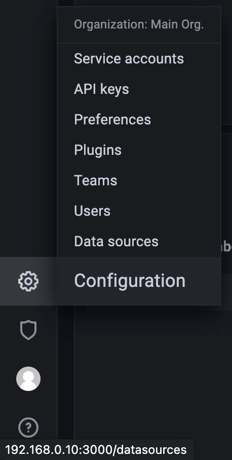
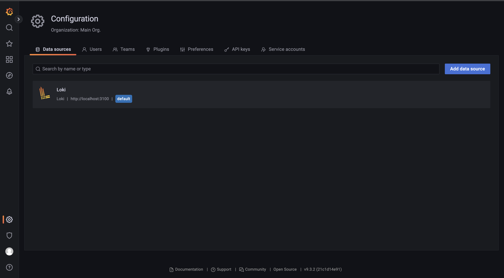
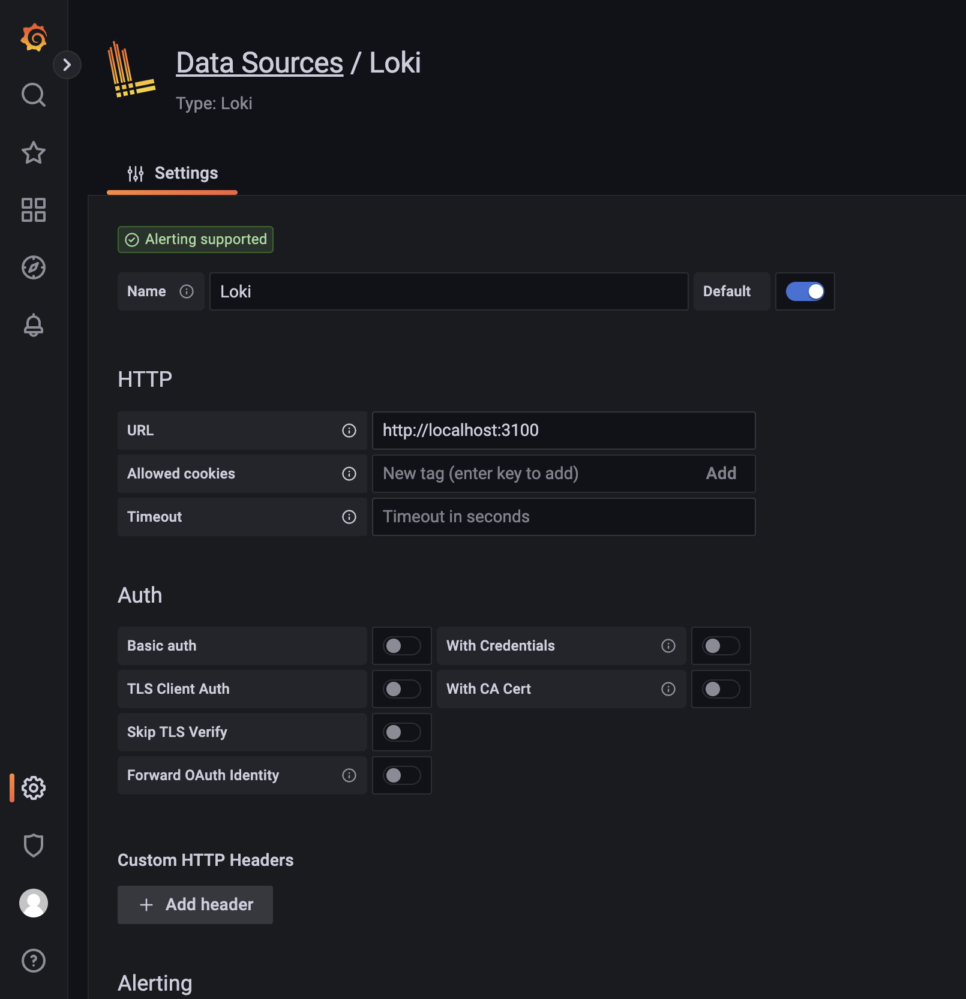
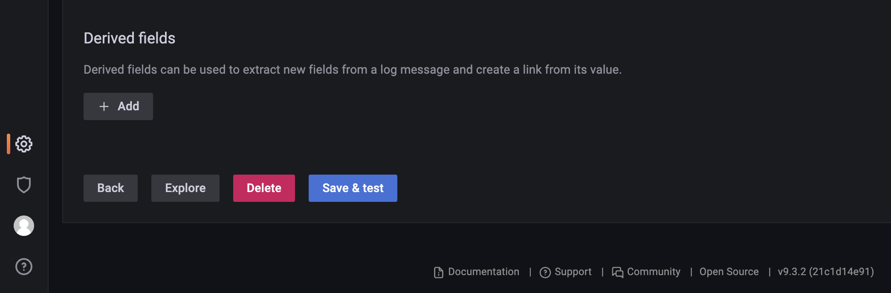
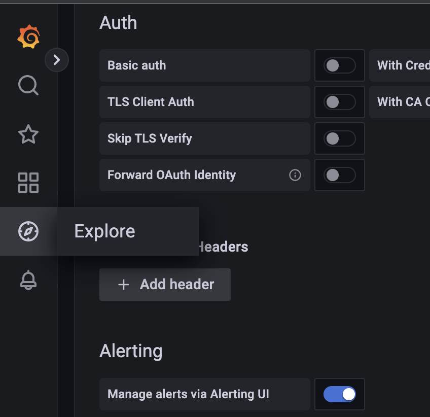
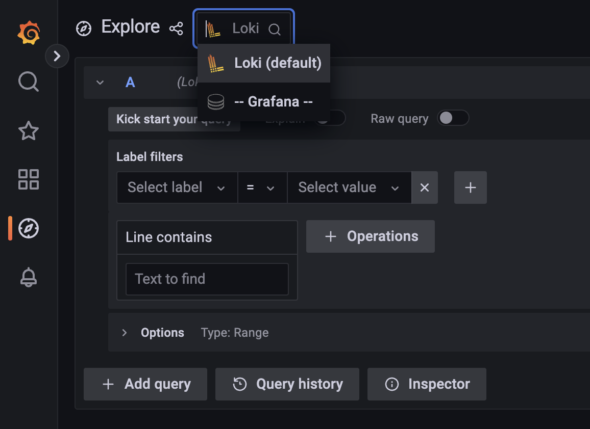

# Grafana, Loki, and Promtail for Log Storage and Analysis

_How do Grafana, Loki, and Promtail handle log aggregation and storage, and how does this compare to_ [_Gravwell_](../gravwell/README.md)_?_

<style>
    code {
        white-space : pre-wrap !important;
    }
</style>

---

Developed by [Grafana Labs](https://grafana.com/), the trio of [Grafana](https://grafana.com/grafana/), [Loki](https://grafana.com/logs/), and [Promtail](https://grafana.com/docs/loki/latest/clients/promtail/) form a complete open source monitoring system stack. Being highly configurable, relatively well polished, and constantly developed makes this stack a competitive option when deciding between free log aggregation, storage, and analysis tools. [In my opinion](#conclusion), the features outlined in this document make Grafana, Loki, and Promtail a better option than [Gravwell](../gravwell/README.md) within this space of free and open source log aggregation software.

## Contents

- [The Observability Stack](#the-observability-stack)
- [Setup - Ubuntu Server](#setup---ubuntu-server)
- [Limitations, Drawbacks, & Comparisons to Gravwell](#limitations-drawbacks--comparisons-to-gravwell)
- [My Opinions](#my-opinions)
- [Conclusion](#conclusion)
- [Troubleshooting](#troubleshooting)
- [Additional Notes & References](#additional-notes--references)

---

## The Observability Stack

While Grafana Labs' various products can be used independently from each other, I used [Grafana](#grafana), [Loki](#loki), and [Promtail](#promtail) all together for this project, running on the same machine.

Grafana discusses their [Observability Stack](https://grafana.com/about/press/2021/02/17/grafana-labs-introduces-grafana-enterprise-stack/) in various places on their site. Since their open source tools are already designed to work together with minimal setup, I thought it would be easiest to use them this way while testing. However, each component can be used in isolation, instead.

### [Grafana](https://grafana.com/docs/grafana/latest/)

Grafana Labs' namesake product is _Grafana_, a visualization and dashboarding software that can be run [from the cloud](https://grafana.com/docs/grafana/latest/introduction/grafana-cloud/) or [hosted locally](https://grafana.com/docs/grafana/latest/introduction/) (with an option to upgrade to an [Enterprise scale](https://grafana.com/docs/grafana/latest/introduction/grafana-enterprise/)). It has rich [integrations for many industry standard data sources](https://grafana.com/docs/grafana/latest/datasources/), including [InfluxDB](https://grafana.com/docs/grafana/latest/datasources/influxdb/), [MySQL](https://grafana.com/docs/grafana/latest/datasources/mysql/), and [PostgreSQL](https://grafana.com/docs/grafana/latest/datasources/postgres/), and its [large open source community](#active-development) means that new features are frequently developed.

### [Loki](https://grafana.com/docs/loki/latest/)

Loki is Grafana Labs' solution to log aggregation. As described in [Loki's documentation](https://grafana.com/docs/loki/latest/fundamentals/overview/), "Loki is a datastore optimized for efficiently holding log data. The efficient indexing of log data distinguishes Loki from other logging systems. **Unlike other logging systems, a Loki index is built from labels, leaving the original log message unindexed**."

Loki also supports its own query language, [LogQL](https://grafana.com/docs/loki/latest/logql/), which is based on [PromQL](https://prometheus.io/docs/prometheus/latest/querying/basics/). Loki is described by the Grafana Labs team as ["Like Prometheus, but for Logs"](https://grafana.com/go/webinar/intro-to-loki-like-prometheus-but-for-logs).

### [Promtail](https://grafana.com/docs/loki/latest/clients/promtail/)

Promtail is an [open source](https://github.com/grafana/loki/tree/main/clients/pkg/promtail) agent which ships local logs to a Loki instance. Since it is developed by Grafana Labs, it comes ready to use with Loki, and in conjunction, with Grafana. In a production environment, a Promtail agent should be installed on each device that needs to be monitored. For this project, Promtail is installed on the same machine as Grafana and Loki since it will only be used to [migrate logs](#migration-tools) that already exist.

## Setup - Ubuntu Server

During testing, I setup this Grafana stack on an [Intel NUC](#equipment) running [Ubuntu Server 20.04 LTS](#equipment) using the steps outlined below.

### Installation

#### [Grafana](#downloads)

Grafana's installation is relatively straightforward when following [the documentation](https://grafana.com/docs/grafana/latest/setup-grafana/installation/debian/) that Grafana Labs provides. Since the server I set up Grafana on isn't connected to the internet, I downloaded the available [standalone Linux binary](https://grafana.com/grafana/download?edition=oss#:~:text=Standalone%20Linux%20Binaries) to my laptop and copied it to the server:

```bash
wget https://dl.grafana.com/oss/release/grafana-9.3.2.linux-amd64.tar.gz
scp grafana-9.3.2.linux-amd64.tar.gz ubuntu@192.168.0.10:~
```

There, it can be unzipped:

```bash
tar -zxvf grafana-9.3.2.linux-amd64.tar.gz
```

To run Grafana, use the `grafana-server` binary:

```bash
./grafana-9.3.2/bin/grafana-server
```

It should start-up with something like this:

```bash
INFO [02-01|17:21:37] Starting Grafana logger=settings version=9.3.2 commit=21c1d14e91 branch=HEAD compiled=2022-12-14T10:40:18Z
INFO [02-01|17:21:37] Config loaded from logger=settings file=/usr/bin/grafana-9.3.2/conf/defaults.ini
...
```

Now, the server is running and the web interface can be accessed on [port 3000](http://localhost:3000). From this interface, the Loki data source can be configured.

#### [Loki](#downloads)

Loki can be downloaded from Grafana's [GitHub release page](https://github.com/grafana/loki/releases/). In this case, I downloaded the `loki-linux-amd64.zip` file. Then, it can be copied to the server:

```bash
scp loki-linux-amd64.zip ubuntu@192.168.0.10:~
```

Once unzipped, the executable can be copied to `/usr/bin`:

```bash
unzip loki-linux-amd64.zip
sudo mv loki-linux-amd64 /usr/bin
```

Now, Loki can be started with:

```bash
loki-linux-amd64
```

Since it was installed as a standalone binary, it will fail without a [config file](#loki-2). However, this error message at least means that it is working:

```
failed parsing config: config.yaml,config/config.yaml does not exist, set config.file for custom config path
```

Configuration details are located in the [configuration section of this document](#loki-2).

#### [Promtail](#downloads)

Like [Loki](#loki-1), a Promtail executable can also be downloaded from Grafana's [GitHub release page](https://github.com/grafana/loki/releases/). Find the appropriate release for your system, download it, and copy it to the server.

```bash
scp promtail-linux-amd64.zip ubuntu@192.168.0.10:~
```

Now, just like the Loki installation, it can be unzipped and moved to `/usr/bin`:

```bash
unzip promtail-linux-amd64.zip
sudo mv promtail-linux-amd64 /usr/bin
```

Now, the Promtail agent can be started with:

```bash
promtail-linux-amd64
```

This will also fail without a [config file](#promtail-2) since it was installed as a standalone executable:

```
level=info ts=2023-02-01T19:10:30.845273148Z caller=promtail.go:123 msg="Reloading configuration file" md5sum=a3442dc04336603ee20d15b2ddb2e1ba
level=error ts=2023-02-01T19:10:30.845295883Z caller=main.go:167 msg="error creating promtail" error="at least one client config should be provided"
```

Configuration is covered in the next section.

### Configuration

This section contains a suggested order for configuration of each of the components of the stack. Loki is first, since Grafana cannot link to the Loki data source until it is setup and Promtail will not be able to send any data to a Loki server that does not exist. Promtail comes next, as Grafana will not be able to fetch any data from Loki without Promtail feeding that data through Loki first. Once Loki and Promtail are setup, Grafana will be able to fetch and display any logs that have been imported.

#### [Loki](https://grafana.com/docs/loki/latest/configuration/)

Loki needs to be configured to listen for incoming data from Promtail. This can be achieved by editing one of the [example starter files provided by Grafana Labs](https://grafana.com/docs/loki/latest/configuration/examples/).

For more information about configuration, visit the [Loki documentation](https://grafana.com/docs/loki/latest/configuration/).

This project used the following config:
```ini
auth_enabled: false

server:
  http_listen_port: 3100
  grpc_listen_port: 9096

common:
  path_prefix: /tmp/loki
  storage:
    filesystem:
      chunks_directory: /tmp/loki/chunks
      rules_directory: /tmp/loki/rules
  replication_factor: 1
  ring:
    instance_addr: 127.0.0.1
    kvstore:
      store: inmemory

query_range:
  results_cache:
    cache:
      embedded_cache:
        enabled: true
        max_size_mb: 100

schema_config:
  configs:
    - from: 2020-10-24
      store: boltdb-shipper
      object_store: filesystem
      schema: v11
      index:
        prefix: index_
        period: 24h

storage_config:
  boltdb:
    directory: /data/loki/index

  filesystem:
    directory: /data/loki/chunks

limits_config:
  ingestion_rate_mb: 8

ruler:
  alertmanager_url: http://localhost:9093
```

The most important settings to note from this config are in the first few lines:
```
server:
  http_listen_port: 3100
  grpc_listen_port: 9096
```

As you might guess, these indicate which ports to listen for Promtail on.

#### [Promtail](https://grafana.com/docs/loki/latest/clients/promtail/configuration/)

Since Promtail is an agent for Loki, it should be configured to send logs to Loki's intake address. Similar to Loki, [Grafana Labs also provides some example Promtail configs](https://grafana.com/docs/loki/latest/clients/promtail/configuration/#example-static-config).

Visit the Promtail docs for [more information about configuration](https://grafana.com/docs/loki/latest/clients/promtail/configuration).

This is the config used for this project:
```ini
server:
  http_listen_port: 9080
  grpc_listen_port: 0

positions:
  filename: /tmp/positions.yaml

clients:
  - url: http://localhost:3100/loki/api/v1/push

scrape_configs:
- job_name: system
  static_configs:
  - targets:
      - localhost
    labels:
      job: varlogs
      __path__: /var/log/*log
  - targets:
      - localhost
    labels:
      job: syslogs
      __path__: /usr/home/shredos/gravwell/syslog-archive/*.gz
  - targets:
      - localhost
    labels:
      job: siabmgr
      __path__: /usr/home/shredos/gravwell/siabmgrCCC/*
```

While this config is simple, I did have to change a few things in order for the files to be [migrated](#migration-tools) successfully:
```
scrape_configs:
  ...
  - targets:
      - localhost
    labels:
      job: syslogs
      __path__: /usr/home/shredos/gravwell/syslog-archive/*.gz
  - targets:
      - localhost
    labels:
      job: siabmgr
      __path__: /usr/home/shredos/gravwell/siabmgrCCC/*
```

This block dictates the locations of files to be shipped to Loki. In this case, I've specified a `__path__` of `/usr/home/shredos/gravwell/{syslog-archive, siabmgrCCC}/`

#### [Grafana](https://grafana.com/docs/grafana/latest/setup-grafana/configure-grafana/)

Grafana can be configured through the web UI. By default, it runs on [port 3000](http://localhost:3000). To setup Loki, the [data source configuration instructions](https://grafana.com/docs/grafana/latest/datasources/loki/) from the docs can be followed. In short:

<figure style="
  height: auto;
  width: auto;
  display: flex;
  flex-direction: column;
  align-items: center;
">
  
</figure>

1. Hover the cursor over the Configuration (gear) icon.

<figure style="
  height: auto;
  width: auto;
  display: flex;
  flex-direction: column;
  align-items: center;
">
  
</figure>

2. Select Data Sources.

<figure style="
  height: auto;
  width: auto;
  display: flex;
  flex-direction: column;
  align-items: center;
">
  
</figure>

3. Select the Loki data source.

By default, Loki runs on port 3100, so this should be setup and working already. However, it may be necessary to `save & test` the data source to make sure that it works:

<figure style="
  height: auto;
  width: auto;
  display: flex;
  flex-direction: column;
  align-items: center;
">
  
</figure>

4. Save and test Loki.

Now that Loki has been configured as a data source, the log data it contains can be queried through the explore tab:

<figure style="
  height: auto;
  width: auto;
  display: flex;
  flex-direction: column;
  align-items: center;
">
  
</figure>

1. Open the explore menu.

<figure style="
  height: auto;
  width: auto;
  display: flex;
  flex-direction: column;
  align-items: center;
">
  
</figure>

2. Make sure the correct source is selected and enter a query.

## Limitations, Drawbacks, & Comparisons to Gravwell

### Log Functionality
While Loki can be configured in many ways, there are some things that it cannot do out of the box. For example, [LogQL (Loki's query language) cannot parse dates](https://github.com/grafana/loki/issues/3535) right now. While there is a [pull request](https://github.com/grafana/loki/pull/7717) in progress, it has been pending since last November. Gravwell, by comparison, can do this immediately upon log ingestion and without any issues. 

A solution to this would be to change Promtail's configuration, utilizing regex in the [pipeline](https://grafana.com/docs/loki/latest/clients/promtail/pipelines/) to parse logs (see [this example](https://github.com/grafana/loki/issues/3535#issuecomment-837806593)). While this is functional, it means that any logs that are labeled incorrectly after setting this up will either remain unseen or will need to be re-ingested.

### Setup Time & Scaling

One of the advantages of Gravwell is its ease of use. Instead of needing to setup an entire stack, Gravwell can be used from a single binary, running on one management device. Grafana, on the other hand, requires separate manual setup of the frontend, backend, and any ingestion agents (in this case, any Promtail instances).

While this may be a benefit in a situation that requires scalability, allowing for separate scaling of each component of the stack as necessary, [Gravwell can also be run as a distributed system](https://docs.gravwell.io/architecture/architecture.html). In addition to each component of the Grafana stack being capable of separate deployment, [Loki can be run in "microservices mode"](https://grafana.com/docs/loki/latest/fundamentals/architecture/deployment-modes/), which allows for each of its components to be deployed as a microservice.

### Migration Tools

Unlike Gravwell, Loki lacks any log migration tools. The suggested solution is to instead point the Promtail agent at a static location where the logs are stored. In the case of this project, that just means adding these lines to the `scrape-config` block of Promtail's config file:
```
  - targets:
      - localhost
    labels:
      job: syslogs
      __path__: /home/shredos/gravwell/syslog-archive/*.gz
  - targets:
      - localhost
    labels:
      job: siabmgr
      __path__: /home/shredos/gravwell/siabmgrCCC/*
```

While this works, it feels a little clunky compared to a [dedicated migration tool](https://documentation.gravwell.io/migrate/migrate.html), and it can lead to [errors when ingesting too much at once](#loki-ingestion-rate-limit).

## My Opinions

### User Experience

From the frontend, I much prefer Grafana's interface to Gravwell's. Gravwell has some [issues with a clunky-to-use UI](../gravwell/README.md#clunky-ui), which Grafana doesn't suffer from. As a robust dashboarding software, Grafana is capable of complex visualization. When [configuring a data source](#grafana-2), its is easy to use and understand.

While I prefer Grafana's web interface to Gravwell's, the backend setup of Gravwell's services was a little more intuitive for me. Since Gravwell is packaged as a single program, there is no need to setup and configure each component of the stack individually. Grafana, on the other hand, requires setup for each component of the stack. 

### Documentation

Grafana, Loki, and Promtail have fairly comprehensive documentation. While Grafana's stands out as being especially well polished and complete, Loki and Promtail still have much more than enough information to get setup and started. Promtail has the weakest documentation, existing only as [a section of Loki's docs](https://grafana.com/docs/loki/latest/clients/promtail/). However, notes on [configuration](https://grafana.com/docs/loki/latest/clients/promtail/configuration/) and example config files make it useable.

When compared to [Gravwell](https://docs.gravwell.io/), I prefer Grafana's documentation.

### Active Development

Grafana Labs has a [relatively large development team](https://grafana.com/about/team/). This allows them to actively develop new features and software, and maintain older services. On the other hand, Gravwell's team is much smaller.

For comparison, [Grafana's GitHub repo](https://github.com/grafana/grafana) has nearly 2000 contributors. [Gravwell's repo](https://github.com/gravwell/gravwell) has 10. While GitHub stats aren't the best metric for comparison, this massive difference does give some sense of the scale of each project.

## Conclusion

Grafana, Loki, and Promtail are highly configurable and designed to work well together. However, they can be a little tedious to get setup when compared to Gravwell, and some [functionality limitations and drawbacks](#limitations-drawbacks--comparisons-to-gravwell) make it a little less convenient for some tasks. That being said, the absence of a [rate limit](../gravwell/README.md#data-ingest), a cleaner [user experience](#user-experience), and [better documentation](#documentation) convince me that the Grafana stack is better suited for long-term use than Gravwell.

## Troubleshooting

### Port 3100 in use

When I first tried to get Grafana, Loki, and Promtail running, ran into a repeated issue with Loki. After starting up the Grafana server and Promtail agent, Loki would refuse to start. After some trial and error, I found that Loki could not start on port 3100 since another service was already running on this port.

In short, both the Gravwell agent and Loki run on port 3100, so Gravwell must be stopped before Loki will start.

### Loki Ingestion Rate Limit

As described [above](#migration-tools), Promtail and Loki don't have a dedicated log migration tool. Instead, the suggested method for migrating large amounts of logs is to point Promtail at their location on your device. While the OSS Grafana stack does not have a daily ingest limit, [unlike Gravwell](../gravwell/README.md#data-ingest), importing logs through Loki can be a little slow by default, leading to a backup of log files with continuous error messages like this:

```bash
level=warn ts=2023-02-01T17:48:53.313036925Z caller=client.go:379 component=client host=localhost:3100 msg="error sending batch, will retry" status=429 error="server returned HTTP status 429 Too Many Requests (429): Ingestion rate limit exceeded for user fake (limit: 4194304 bytes/sec) while attempting to ingest '6510' lines totaling '1048430' bytes, reduce log volume or contact your Loki administrator to see if the limit can be increased"
```

Loki has a [default ingestion rate of 4 MB/sec/user](https://grafana.com/docs/loki/latest/configuration/#limits_config:~:text=%5Bingestion_rate_mb%3A%20%3Cfloat%3E%20%7C%20default%20%3D%204%5D). In this case, the ingestion rate of my system was slightly above the limit. This can be configured with the [`limits_config`](https://grafana.com/docs/loki/latest/configuration/#limits_config) block of the Loki config file. The issue was resolved by doubling this limit through the config:

```
limits_config:
  ingestion_rate_mb: 8
```

## Additional Notes & References

### Downloads

- [Grafana OSS](https://grafana.com/grafana/download?edition=oss)
- [Loki (run locally)](https://grafana.com/docs/loki/latest/installation/local/)
- [Promtail](https://grafana.com/docs/loki/latest/clients/promtail/installation/)

### Equipment

- [Intel NUC](https://ark.intel.com/content/www/us/en/ark/products/95067/intel-nuc-kit-nuc7i5bnh.html)
- [Ubuntu 20.04](https://releases.ubuntu.com/20.04/)
