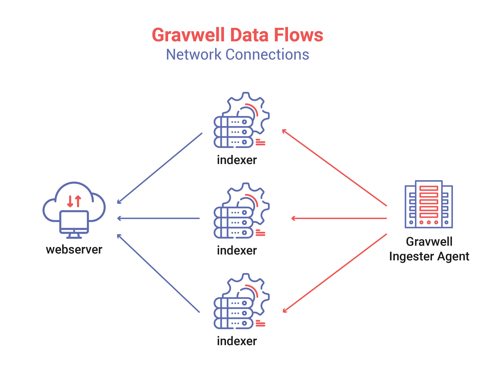
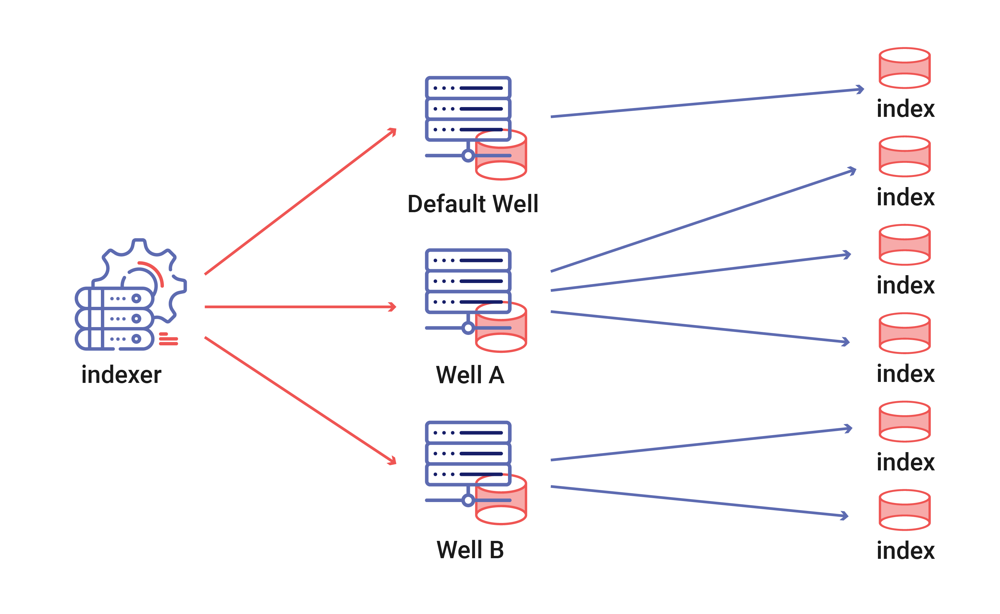
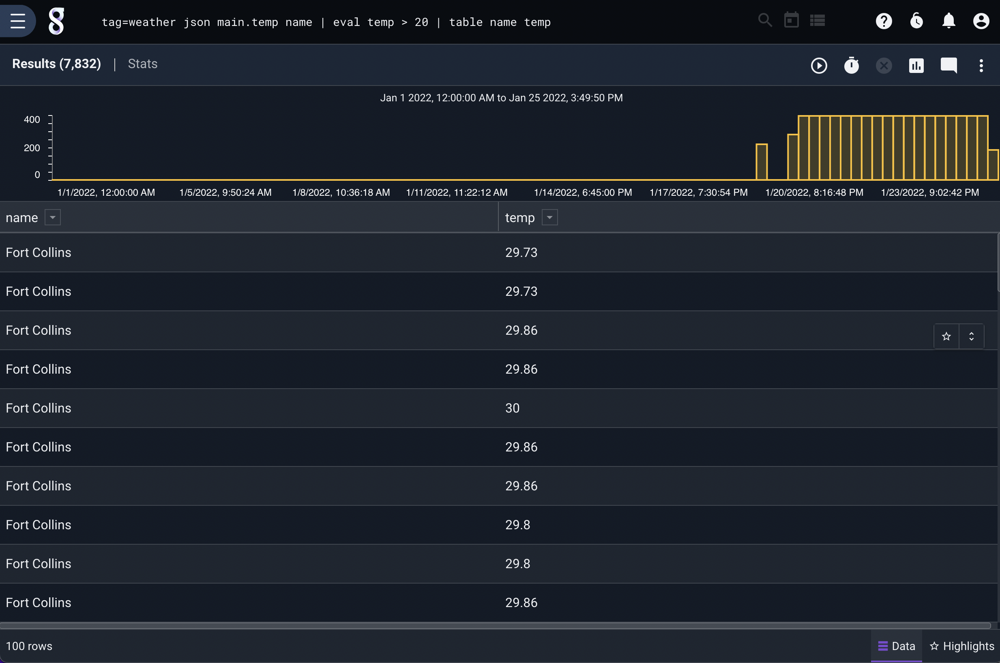

# Gravwell

_How do the different versions of Gravwell compare? How does Gravwell compare to alternative solutions?_

---

Gravwell is a data storage and analysis platform designed to compete with Splunk. It is simpler to setup and use, offers node-based pricing, and is [open source](https://github.com/gravwell/gravwell). It can be self-hosted, and it's designed to be able to ingest and store any kind of data. This document will explore Gravwell's structure and capabilities, the differences between different versions of the software, and what makes it different from alternative solutions.

## Contents

- [Gravwell Components](#gravwell-components)
- [Comparing Pricing Options](#comparing-pricing-options)
- [Gravwell Features & Constraints](#gravwell-features--constraints)
- [Personal Opinions](#personal-opinions)
- [Alternative Solutions](#alternative-software)
- [Additional Notes & References](#additional-notes--references)

---

## Gravwell Components

<figure style="
  height: auto; 
  width: auto;
  display: flex;
  flex-direction: column;
  align-items: center;
">
  
</figure>

When taking a look at [Gravwell's system architecture](https://docs.gravwell.io/architecture/architecture.html), you might find the following pieces:

- **Backend**: [Ingest](#ingest), [Storage](#storage)
- **Frontend**: [Analysis](#analysis), [Search](#search), [Automation](#automation)

The following is a breakdown of some of the basic features of each of these components.

### [Ingest](https://docs.gravwell.io/ingesters/ingesters.html)

Gravwell's ingesters "gather incoming data, package it into Gravwell entries, and ship it to Gravwell indexers for storage." Gravwell offers many different [official ingesters](https://docs.gravwell.io/ingesters/ingesters.html#ingesters-list), and the [open-source ingest API](https://github.com/gravwell/gravwell/tree/master/ingest) allows for the creation of your own. Ingesters feed data to indexers, which are responsible for [storage](#storage).

#### [Tags](https://docs.gravwell.io/ingesters/ingesters.html#tags)

Every piece of data that Gravwell ingests is tagged. Tags allow for easier [search](#search) and [query](#analysis), and categorize incoming data. From the user’s point of view, tags are strings such as “syslog”, “pcap-router”, or “default”. Since tags are used for [querying](#search) later, it can be useful to decide on a consistent naming scheme. For example, the tags for five servers might look like this:

```
syslog-http-server1
syslog-http-server2
syslog-file-server1
syslog-file-server2
syslog-email-server1
```

Since wildcards are allowed in queries, this enables flexible searching. For example, you could search `tag=syslog-*` to find all the syslogs. You can search over all HTTP server logs by specifying `tag=syslog-http-*`.

### [Storage]()

<figure style="
  height: auto; 
  width: auto;
  display: flex;
  flex-direction: column;
  align-items: center;
">
  
</figure>

Storage in Gravwell is handled by indexers.

Gravwell stores unstructured data, using a **schema-on-read** approach to [analysis](#analysis) and [search](#search). This is great for importing data quickly, [storing anything](#ingest-anything), or changing the way old data is structured; however, it means that searching and dashboarding is much slower than a traditional schema-on-write approach.

### [Search](https://documentation.gravwell.io/search/search.html)

Gravwell's search pipeline is core to its functionality. Here is an example query:

```sql
tag=weather json main.temp name | eval temp > 20 | table name temp
```

#### Query Structure

The above example query contains a few components:

##### Tag Specification

The first part of a Gravwell query is the tag specification. In the above example this would be:

```sql
tag=weather
```

Multiple tags can also be specified:

```sql
tag=syslog,pcap
```

Or wildcards can be used:

```sql
tag=syslog-http-*,syslog-firewall-*
```

##### [Extraction Modules](https://documentation.gravwell.io/search/extractionmodules.html)

Since Gravwell stores data in a structure-on-read format, extraction modules are used to extract ands structure data that is fetched by the tag. In the above example, this would be:

```sql
json main.temp name
```

Here, the `json` module extracts the JSON weather data that is stored, fetching the `main.temp` and `name` fields.

##### [Processing Modules](https://documentation.gravwell.io/search/processingmodules.html)

In next in the pipeline, the `eval` module filters for the appropriate temperature:

```sql
eval temp > 20
```

Processing modules are used to filter or analyze data. Some common modules that might be used are:

- `diff` - compare fields between entries.
- `eval` - evaluate arbitrary logic expressions.
- `grap` - search for strings in entries.
- `regex` - match and extract data using regular expressions.

[More modules can be found in the Gravwell documentation](https://documentation.gravwell.io/search/processingmodules.html).

Multiple processing modules can also be added to the pipeline in a process called _data fusion_. For example, this query fetches the tags `reddit` and `hackernews` and then applies different processing modules to each:

```sql
tag=reddit,hackernews tag=reddit json Body | tag=hackernews json body as Body | eval len(Body) < 20 | table Body
```

##### [Render Modules](https://documentation.gravwell.io/search/rendermodules.html)

Finally, the in last step in the example pipeline, the `table` module formats an output table with the columns name and temp:

```sql
table name temp
```

All together, this query results in the following output:

<figure style="
  height: auto; 
  width: auto;
  display: flex;
  flex-direction: column;
  align-items: center;
">
  
</figure>

### [Analysis]()

### [Automation]()

## Comparing Pricing Options

Gravwell offers many different choices for software edition and support level. These vary in price and functionality.

### [Software](https://www.gravwell.io/pricing)

#### 1. Community Edition

**Free**

- limited to one indexer
- must be self-hosted
- [13.9 GB/day ingest limit](#data-ingest)

#### 2. Pro Edition

**$24,000/node/year**

- all features of Community Edition
- unlimited data ingest
- unlimited ingester endpoints
- unlimited search
- SSO support

#### 3. Enterprise Edition

**$48,000/node/year**

- all features of Pro Edition
- unlimited automations
- distributed web frontends
- online "hot" replication

#### 4. Enterprise Cloud Edition

**$48,000+/year**

- all features of Enterprise edition
- cloud-hosted

### [Support](https://www.gravwell.io/pricing#hs_cos_wrapper_module_16678503781958)

Gravwell also offers three tiers of professional support (pricing for each option is not posted):

#### 1. Basic

- **Response time**: 8 business hours (Severity 1) - 4 business days (Severity 4)

#### 2. Professional

- **Response time**: 3 hours initial response, daily updates (Severity 1) - 3 business days (Severity 4)
- **Training**: Coursework available
- **Designated Account Manager**

#### 3. Premium

- **Response time**: 1 hour initial response, updates every 3 hours (Severity 1) - 2 business days (Severity 4)
- **Training**: included
- **Designated Account Manager**
- **Designated Technical Expert**

## Gravwell Features & Constraints

### Data Ingest

The free community edition of Gravwell has an ingest limit of 13.9 GB/day. While this should usually be enough for small systems, I ran into issues while trying to migrate existing data. Since I had 30 GB of data total, it was impossible to ingest it all in one day.

## Personal Opinions

**Gravwell is a very good FOSS product. However, it seems lacking in a few areas that its competitors succeed at. In my opinion, Gravwell would be best used in conjunction with another free software, like Grafana.**

### Mediocre Documentation

While the Gravwell documentation is useable, it seems less extensive or polished than the documentation for comparable services, like Splunk. While a [training manual](./gravwell_training_5.1.2.pdf) is offered, it only contains information relevant to certification and (in my opinion) lacks sufficient instruction for "getting started".

There is also less of a public community user base on forums such as Stack Overflow, making finding answers for specific issues sometimes a little difficult when compared to other, more widely-used platforms.

### "Ingest Anything"

Because of Gravwell's **schema-on-read** system, 

On their [Gravwell vs Splunk page](https://www.gravwell.io/gravwell-vs-splunk), the makers of Gravwell tout that "[their] platform ingests everything and compromises nothing. Splunk can’t say that." However, it seems like Splunk can ingest just about everything that would be needed in almost every situation.

### Intermittent Crashes

I setup a Gravwell server on an Intel NUC, which I ssh'd into. While this could be a hardware issue, it seems like the connection is sometimes terminated when Gravwell is struggling to load large amounts of logs. For example, while setting up a dashboard for syslogs, the server regularly crashed when attempting to load a visualization for 10M entries. Admittedly, this is a lot of entries to display and is perhaps indicative of a bug with my search query, but I thought that it is worth mentioning.

### Clunky UI

Gravwell's general UX feels relatively clunky and unpolished to me. See this example:

### It's FOSS

Certainly, having the option of using Gravwell for free is great. As a solution for storing and analyzing log data, Gravwell is as good as you could ask for if you want to avoid paying too much. Also, since it is open source, it's relatively easy to add features you need or modify the software to your liking.

## Alternative Software

### [Splunk](https://www.splunk.com)

Gravwell positions its product in [direct competition with Splunk](https://www.gravwell.io/gravwell-vs-splunk). Some main differences are:

- **Pricing Model** - Gravwell offers node-based pricing, while [Splunk offers volume- or compute-based pricing](https://www.splunk.com/en_us/products/pricing/enterprise-platform.html).
- **Search/Query** - Splunk uses a proprietary query language. Gravwell's query language is open source.

### [Grafana](https://grafana.com/)

In my opinion, Grafana handles data visualization and analysis more elegantly than Gravwell. Grafana also offers solutions for [logging](https://grafana.com/logs/), [metrics](https://grafana.com/metrics/), and [tracing](https://grafana.com/traces/).

## Additional Notes & References

- [Gravwell](https://www.gravwell.io/)
- [Gravwell Documentation](https://docs.gravwell.io/)
